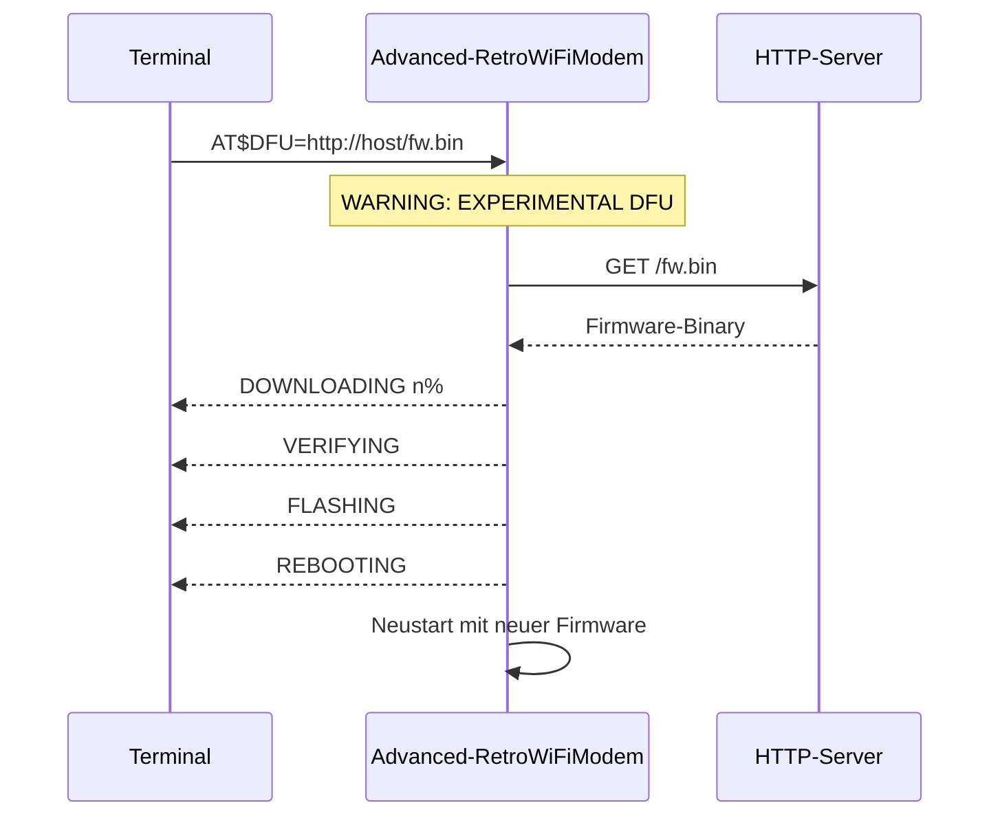
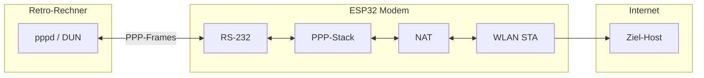

# Advanced Retro WiFi Modem

> **AI-Test-Branch — nicht für den Produktionseinsatz**  
> Dieser Branch (`ai`) ist ein experimentelles Testfeld für neue Funktionen (DFU, PPP). Er dient Entwicklung und Evaluation. Ohne eigene Prüfung, Tests und Absicherung nicht in Produktion oder sicherheitskritischen Umgebungen einsetzen.

Ein RS-232-WLAN-Modem mit Hayes-AT-Befehlen, Status-LEDs und vollem Satz an RS-232-Steuerleitungen.

Dieses Repository bietet zwei Wege:

| Variante | Umfang |
|----------|--------|
| **ESP8266** | Turnkey-Lösung — Firmware, KiCad-Projekt, Gerber und Stückliste |
| **ESP32-WROOM-DA** | Nur Firmware — kein Platinenlayout, eigene Hardware erforderlich |

## Funktionsübersicht

| Funktion | ESP8266 | ESP32 | Reifegrad |
|----------|---------|-------|-----------|
| Hayes-AT, `ATDT`, Telnet, TCP-Server, NVRAM | ✓ | ✓ | Stabil (Hauptfunktion) |
| OTA per Arduino IDE (Entwickler) | ✓ | ✓ | Stabil |
| **DFU** (`AT$DFU=…`) | ✓ | ✓ | **Experimentell** — siehe unten |
| **PPP + NAT** (`ATD*99#`) | ✗ (Stub) | ✓ | ESP32: getestet mit Linux `pppd` |

## Was in diesem Repository enthalten ist

### ESP8266 (Turnkey)

| Pfad | Inhalt |
|------|--------|
| `firmware/esp8266/Advanced-RetroWiFiModem/` | Arduino-Sketch für Wemos D1 mini |
| `kicad/esp8266/` | KiCad-Projekt (Schaltplan, Layout, Bibliotheken) |
| `kicad/esp8266/gerbers/` | Fertige Gerber-Dateien zum Bestellen der Platine |

Platine bestellen, Bauteile löten, Wemos D1 mini einstecken, Firmware flashen — fertig.

### ESP32-WROOM-DA (nur Firmware)

| Pfad | Inhalt |
|------|--------|
| `firmware/esp32/Advanced-RetroWiFiModem/` | Arduino-Sketch-Port für ESP32-WROOM-DA |

Kein Schaltplan, kein Layout, keine Gerber. Die GPIO-Belegung in `firmware/esp32/Advanced-RetroWiFiModem/Advanced-RetroWiFiModem.h` orientiert sich an der ESP8266-Platine und muss an die eigene Verdrahtung angepasst werden.

### Allgemein

| Pfad | Inhalt |
|------|--------|
| `LICENSE.txt` | GNU GPL v3 |

## Funktionen

### Kern (stabil)

- RS-232-Schnittstelle (DE-9) mit TxD, RxD, RTS, CTS, DSR, DTR, DCD und RI
- Hayes-AT-Befehlssatz im WiFi232-Stil
- TCP-Verbindungen zu BBSen, Telnet-Servern und anderen Diensten
- Telnet-Protokoll: echt, fake (für bestimmte BBSen) oder deaktiviert
- 10 Kurzwahl-Slots mit Alias-Namen
- TCP-Server-Modus mit optionalem Passwort
- OTA-Firmware-Update über WLAN (Arduino IDE, Entwickler-Workflow)

### Neu auf Branch `ai`

- **PPP-Dial-up mit NAT (nur ESP32):** `ATD*99#` oder `AT$PPP=1` — Retro-Rechner erhält IP `192.168.240.2`, Modem `192.168.240.1`, Internet-Zugang über WLAN-NAT
- **DFU (experimentell, beide Plattformen):** `AT$DFU=http://host/firmware.bin` oder `AT$DFU=xmodem` — Endnutzer-Update ohne Arduino IDE; **auf eigenes Risiko**, siehe [DFU](#dfu-firmware-update-per-at-befehl--experimentell)

## ESP8266 — Hardware und Aufbau

Die Platine in `kicad/esp8266/` ist für einen [Wemos D1 mini](https://docs.wemos.cc/en/latest/d1/d1_mini.html) ausgelegt.

| Komponente | Funktion |
|------------|----------|
| Wemos D1 mini | ESP8266 mit WLAN |
| MAX3237 | RS-232-Pegelwandler (3,3 V ↔ ±12 V) |
| 74HCT245 | LED-Treiber für Statusanzeigen |
| 74HC32 | OR-Gatter — maskiert Boot-Ausgabe auf der seriellen Leitung |
| LM2931 | Separater 3,3-V-Regler für Peripherie |
| DFPlayer Mini | Auf der Platine vorgesehen (nicht von der Firmware angesteuert) |

**Stromversorgung:** 5 V, Mittelkontakt positiv, Hohlstecker 2,1 × 5,5 mm.

**Platine bestellen:** Gerber in `kicad/esp8266/gerbers/`.

**Schaltplan bearbeiten:** `kicad/esp8266/RetroWiFiModem.kicad_pro` in KiCad öffnen.

### Pinbelegung ESP8266 (Wemos D1 mini auf der Platine)

Definiert in `firmware/esp8266/Advanced-RetroWiFiModem/Advanced-RetroWiFiModem.h`:

| Signal | GPIO | D1-mini-Pin | Anbindung |
|--------|------|-------------|-----------|
| Serial TX | 1 | Tx | MAX3237 (über OR-Gatter) |
| Serial RX | 3 | Rx | MAX3237 |
| DSR | 4 | D2 | MAX3237 |
| DCD | 5 | D1 | MAX3237 |
| DTR (Eingang) | 0 | D3 | MAX3237 |
| TXEN | 14 | D5 | OR-Gatter (Boot-Müll maskieren) |
| RI | 12 | D6 | MAX3237 + LED |
| RTS (Eingang) | 13 | D7 | MAX3237 |
| CTS (Ausgang) | 15 | D8 | MAX3237 |

> RTS/CTS sind aus Modem-Sicht (DCE) benannt.

## Firmware

Beide Varianten teilen dieselbe Modulstruktur:

```
Advanced-RetroWiFiModem.ino    — Hauptschleife, Setup
Advanced-RetroWiFiModem.h      — Konstanten, Pin-Definitionen
globals.h             — Globale Variablen, Einstellungsstruktur
support.h             — Hilfsfunktionen, Telnet, Verbindungslogik
at_basic.h            — Standard-AT-Befehle
at_extended.h         — Erweiterte AT-Befehle (&D, &F, &K, &W, …)
at_proprietary.h      — Proprietäre AT-Befehle (AT$…)
dfu.h / xmodem.h      — Experimentelles Firmware-Update (AT$DFU)
ppp.h                 — PPP-Dial-up + NAT (ESP32; ESP8266-Stub)
```

### ESP8266 — `firmware/esp8266/Advanced-RetroWiFiModem/`

Für die Turnkey-Platine mit Wemos D1 mini. In der Arduino IDE den Sketch-Ordner `Advanced-RetroWiFiModem.ino` öffnen.

**Arduino IDE — Voraussetzungen:**

1. Board: *LOLIN(WEMOS) D1 R2 & mini*
2. ESP8266 Core **3.1.2** oder neuer (`https://arduino.esp8266.com/stable/package_esp8266com_index.json`)
3. Bibliothek [ESP_EEPROM](https://github.com/jwrw/ESP_EEPROM) in der aktuellen Version (ab 2.2.0)
4. `eeprom_storage.h` — lazy EEPROM-Init in `setup()` (kein separates Installieren nötig)

Die Firmware initialisiert EEPROM erst in `setup()` mit dem korrekten Flash-Sektor (`EEPROM_start`). Damit funktioniert `AT&W` auch mit ESP_EEPROM 2.2.x und aktuellem ESP8266-Core — die ältere Pinning-Version 2.1.2 ist nicht mehr nötig.

**Arduino IDE:** Tools → Flash Size muss zur Hardware passen (z. B. *4MB (FS:2MB OTA:~1019KB)*).

Board und Port wählen, kompilieren und flashen.

### ESP32-WROOM-DA — `firmware/esp32/Advanced-RetroWiFiModem/`

Nur Software — **kein Board in diesem Repository**. Eigene Hardware mit RS-232-Pegelwandler (z. B. MAX3237) und passender GPIO-Verdrahtung erforderlich.

Die Standard-Pinbelegung in `firmware/esp32/Advanced-RetroWiFiModem/Advanced-RetroWiFiModem.h` entspricht der ESP8266-Platine (siehe Tabelle oben, inkl. DTR an GPIO0). Bei abweichender Verdrahtung die `#define`-Zeilen für CTS, RTS, RI, DSR, DCD, DTR und TXEN anpassen.

**Arduino IDE — Voraussetzungen:**

1. Board-Paket [esp32 by Espressif](https://docs.espressif.com/projects/arduino-esp32/) installieren
2. Board: *ESP32-WROOM-DA Module*

In der Arduino IDE den Sketch-Ordner öffnen, kompilieren und flashen.

> Die ESP8266-Platine ist **nicht** mit einem ESP32-WROOM-DA bestückbar (anderes Modul, andere Boot-Strapping-Anforderungen an GPIO 12 und 15).

> EEPROM-Magic-Number: ESP8266 `0x4321`, ESP32-WROOM-DA `0x4322` — Einstellungen sind nicht zwischen Plattformen austauschbar.

## Ersteinrichtung

Gilt für beide Firmware-Varianten. Werkseinstellung: **1200 Baud, 8N1**. Für die Ersteinrichtung empfiehlt sich `AT$SB=9600` und anschließend `AT&W`.

```
AT$SSID=MeinWLAN
AT$PASS=MeinPasswort
ATC1
AT&W
```

Verbindung aufbauen:

```
ATDTparticles                 ; Kurzwahl per Alias (Werkseinstellung in &F)
ATDTaltair.virtualaltair.com  ; Hostname
ATDT192.168.1.10:6400         ; IP mit Port
```

| Befehl | Beschreibung |
|--------|--------------|
| `AT$SB=n` | Baudrate (110 … 115200) |
| `AT$SU=dps` | Datenbits, Parität, Stoppbits (z. B. `8N1`) |
| `ATNETn` | Telnet: 0=aus, 1=echt, 2=fake |
| `AT&K1` | Hardware-Flowcontrol (RTS/CTS) |
| `AT&Dn` | DTR-Verhalten: 0=ignorieren, 1=Offline, 2=auflegen, 3=Reset |
| `AT$SP=n` | TCP-Server-Port für eingehende Verbindungen |
| `AT$MDNS=name` | mDNS-Name (Standard: `espmodem` / `esp32modem`) |
| `AT&Z0=host:port,alias` | Kurzwahl speichern |

Vollständige Hilfe auf dem Gerät: `AT?`

## AT-Befehle (Kurzübersicht)

Mehrere Befehle pro Zeile möglich (`AT S0=1 Q0 V1`). String-Argumente (`AT$SSID=` usw.) müssen am Zeilenende stehen.

**Verbindung:** `ATDT[+=-]host[:port]`, `ATDSn`, `ATA`, `ATH`, `ATO`, `+++` (Escape)

**WLAN:** `ATC0`/`ATC1`, `ATI`, `ATGEThttp://…`, `ATRD`/`ATRT` (UTC über NTP, `pool.ntp.org`)

**Konfiguration:** `AT&W`, `AT&F`, `AT&V0`/`AT&V1`, `AT&Zn=…`, `AT$SSID=`, `AT$PASS=`, `AT$AE=`, `AT$BM=`, `AT&R=`, `ATZ`

**Verhalten:** `ATE0`/`ATE1`, `ATQ0`/`ATQ1`, `ATV0`/`ATV1`, `ATX0`/`ATX1`, `ATS0=n`, `ATS2=n`, `AT&D0`–`AT&D3`

**Experimentell (Branch `ai`):** `AT$DFU=…`, `ATD*99#`, `AT$PPP=1`/`AT$PPP=0` — Details in den Abschnitten unten

## DFU (Firmware-Update per AT-Befehl) — **experimentell**

> **Haftungsausschluss / Nutzung auf eigenes Risiko**  
> DFU ist eine **experimentelle** Funktion ohne Gewährleistung. Ein falsches Binary (falsche Plattform, beschädigte Datei, Unterbrechung während des Flash-Vorgangs) kann das Gerät **unbrauchbar machen („bricken“)**. Nur die **korrekte** `.bin` für **deine** Plattform (ESP8266 bzw. ESP32) verwenden. Vor dem Update ein Backup der Einstellungen (`AT&V1`) dokumentieren. Bei einem Brick ist in der Regel ein **serieller Re-Flash** mit USB/UART nötig (ESP8266: Wemos-Pin intern; ESP32: je nach eigener Hardware). **Der Autor übernimmt keine Haftung** für Schäden durch DFU-Nutzung.

DFU ersetzt nicht das bewährte **OTA über die Arduino IDE** (siehe [OTA-Updates](#ota-updates)). DFU richtet sich an Endnutzer ohne Entwicklungsumgebung — mit dem oben genannten Risiko.

**Voraussetzungen:** Befehlsmodus (nicht online), keine aktive TCP-Sitzung. HTTP-DFU zusätzlich: WLAN verbunden (`ATC1`).

### HTTP-DFU

```
AT$DFU=http://192.168.1.10/Advanced-RetroWiFiModem.ino.bin
```

Das Modem lädt die Datei per HTTP (kein TLS), prüft sie und schreibt in die OTA-Partition. Fortschritt auf der seriellen Konsole: `DOWNLOADING`, `VERIFYING`, `FLASHING`, `REBOOTING`.



### XMODEM-DFU (ohne HTTP-Server)

```
AT$DFU=xmodem
```

Anschließend mit dem Terminal-Programm die passende `.bin`-Datei per XMODEM senden.

### Status

```
AT$DFU?
```

Mögliche Antworten: `idle`, `downloading`, `verifying`, `flashing`, `xmodem`, `error …`

## PPP (Dial-up IP) — ESP32

PPP wandelt die serielle Leitung in einen IP-Link um — für Retro-Systeme mit `pppd`, Windows-Einwahl oder nativem PPP-Stack. **Nur auf ESP32** implementiert (lwIP `pppos` + NAT). Auf **ESP8266** antwortet `ATD*99#` mit `NO CARRIER` (kein PPP-Stack im Arduino-Core).

| Parameter | Wert |
|-----------|------|
| Modem-IP (lokal) | `192.168.240.1` |
| Peer-IP (Retro-Rechner) | `192.168.240.2` |
| Authentifizierung | PAP (leerer User/Passwort); CHAP nur wenn im lwIP-Build vorhanden |
| Empfohlene Baudrate | `AT$SB=57600` und `AT&W` vor dem Test |

**Einwahl:**

```
ATD*99#
```

oder `AT$PPP=1` — danach auf dem Retro-Rechner `pppd` bzw. Windows-Einwahl starten.

**Auflegen:** `ATH` oder `AT$PPP=0`

`ATDT` (TCP) und PPP sind gegenseitig ausgeschlossen — nur eine Online-Sitzung gleichzeitig.



### Linux-Beispiel (`pppd`)

Serielle Schnittstelle und Baudrate anpassen. Wichtig: `local nocrtscts` (kein Hardware-Handshake am PC), sonst kann DTR/GPIO0 den ESP32 zurücksetzen.

```bash
sudo pppd /dev/ttyUSB1 57600 local nocrtscts nodetach noauth \
  defaultroute replacedefaultroute \
  user "" password "" \
  192.168.240.2:192.168.240.1 \
  connect 'chat -v -t10 ABORT "NO CARRIER" ABORT "ERROR" "" "AT\r" "OK" "ATD*99#\r" "CONNECT"'
```

Nach `CONNECT` und erfolgreichem IPCP:

```bash
ping 192.168.240.1          # Modem
ping -I ppp0 8.8.8.8        # Internet über NAT (ggf. LAN-Interface vorher down)
```

> **Hinweis:** Wenn bereits eine Default-Route über Ethernet existiert, reicht `defaultroute` allein oft nicht — `replacedefaultroute` oder manuell `ip route replace default dev ppp0`.

**Noch wenig getestet:** Windows 9x/98 DUN, Amiga/DOS-native PPP, TCP-Anwendungen über NAT (bisher vor allem ICMP/Ping), Langzeitbetrieb.

## OTA-Updates

Bei aktiver WLAN-Verbindung: Arduino IDE → Sketch → Upload Using Network Address.

> Nach einem Firmware-Update mit neuen EEPROM-Feldern (z. B. `dtrHandling`) einmal `AT&W` oder `AT&F` ausführen, damit die NVRAM-Struktur passt.

## Bekannte Einschränkungen

- **Baudrate:** Keine Auto-Erkennung — `AT$SB` muss zum Terminal passen.
- **Linux-Telnet / Binärdateien:** Viele `0xFF`-Bytes über `telnetd` können die Verbindung abbrechen (Daemon-Problem, nicht Modem). Xmodem/Ymodem mit 128-Byte-Blöcken als Workaround.
- **ESP8266 / RTS/CTS:** Bei `AT&K1` und langem RTS-Stillstand kann der Watchdog auslösen. Die Firmware patched die UART-Sendeschleife mit `yield()`.
- **ESP8266 / PPP:** Nicht verfügbar — `ATD*99#` liefert `NO CARRIER`. Für Dial-up-IP ESP32 verwenden.
- **DFU:** Experimentell; falsche Images können das Gerät bricken. Kein HTTPS. HTTP-DFU erfordert WLAN; XMODEM nicht.
- **PPP / ESP32:** Primär mit Linux `pppd` getestet; Windows-DUN und CHAP noch offen.

## Lizenz

[GNU GPL v3](LICENSE.txt). Basiert auf Virtual-Modem-Code von Jussi Salin (2016), Erweiterungen von Daniel Jameson, Stardot Contributors und Paul Rickards (2018).
