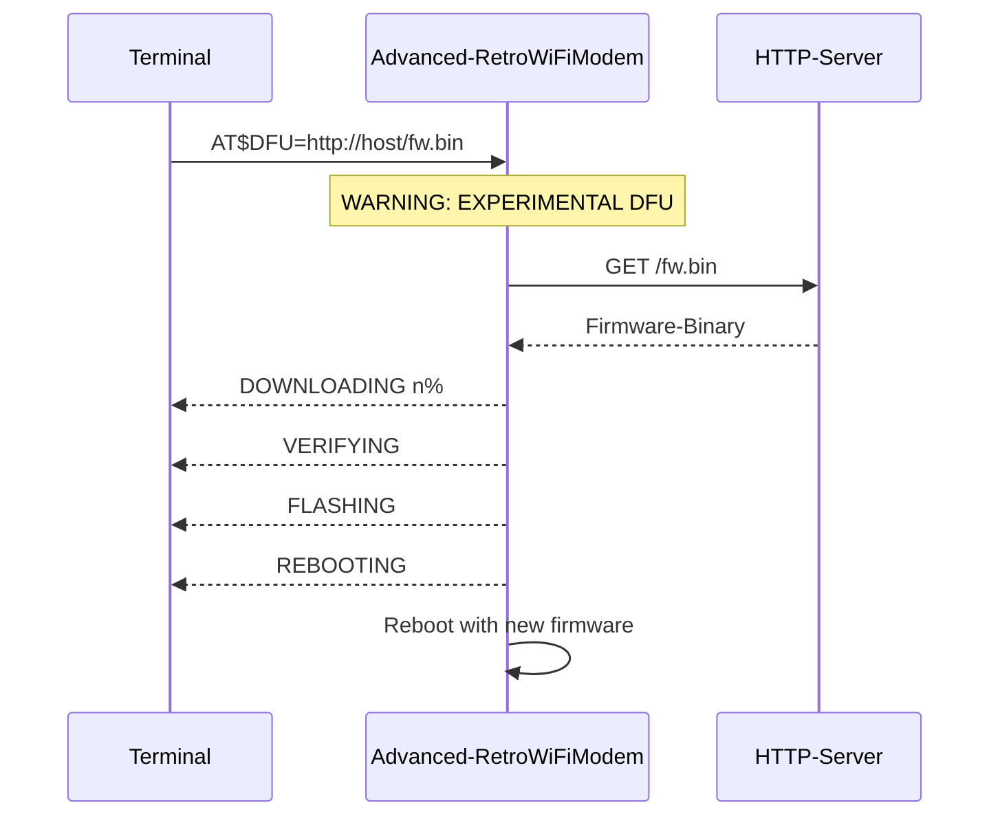
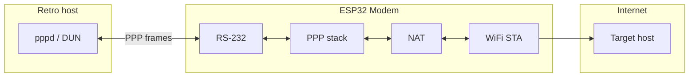

# Advanced Retro WiFi Modem

> **AI-assisted advanced reimplementation** of the original [Retro WiFi Modem](https://github.com/oe3gwu/RetroWiFiModem).

An RS-232 WiFi modem with Hayes AT commands, status LEDs, and a full set of RS-232 control lines.

This repository offers **one Wemos PCB** (`kicad/wemos/`) and **two firmware variants** (pick the module, flash the matching firmware):

| Variant | Module | Uses `kicad/wemos/` | Firmware |
|---------|--------|---------------------|----------|
| **Wemos D1 mini** | ESP8266 ([WEMOS D1 Mini](https://www.wemos.cc/en/latest/d1/index.html)) | Yes | `firmware/wemos-d1-mini/` |
| **Wemos C3 Mini** | ESP32-C3 ([WEMOS C3 Mini](https://www.wemos.cc/en/latest/c3/c3_mini.html)) | Yes (same board) | `firmware/wemos-c3-mini/` |

## Feature overview

| Feature | Wemos D1 mini (ESP8266) | Wemos C3 Mini (ESP32-C3) | Maturity |
|---------|-------------------------|--------------------------|----------|
| Hayes AT, `ATDT`, Telnet, TCP server, NVRAM | ✓ | ✓ | Stable (core functionality) |
| OTA via Arduino IDE (developer) | ✓ | ✓ | Stable |
| **DFU** (`AT$DFU=…`) | ✓ | ✓ | **Experimental** — see below |
| **PPP + NAT** (`ATD*99#`) | ✗ (no stack / stub) | ✓ | ESP32-C3: tested with Linux `pppd`; C3 drop-in validated in field |
| **RAW / transparent mode** (`AT$MODE=RAW`) | ✓ | ✓ | Stable — see [RAW mode](#raw--transparent-mode) |
| **PCB (KiCad / Gerbers / BOM)** | ✓ | ✓ (same `kicad/wemos/`) | Wemos PCB: production-ready |

## What is in this repository

### Wemos PCB (for D1 mini and C3 Mini)

| Path | Contents |
|------|----------|
| `kicad/wemos/` | KiCad project, Gerbers, BOM — **one board for Wemos D1 mini and Wemos C3 Mini** (Wemos-D1-mini socket; layout originally designed for ESP8266) |
| `firmware/wemos-d1-mini/Advanced-RetroWiFiModem/` | Firmware when a **D1 mini (ESP8266)** is installed |
| `firmware/wemos-c3-mini/Advanced-RetroWiFiModem/` | Firmware when a **C3 Mini (ESP32-C3)** is installed |

> **Order one PCB, pick your module:** `kicad/wemos/` is the same board for the Wemos D1 mini and the Wemos C3 Mini — flash the matching firmware.

**Module choice**

| Module | Chip | On the Wemos PCB | Main limitation |
|--------|------|------------------|-----------------|
| **Wemos D1 mini** | ESP8266 | Original design target | **No PPP** — Hayes/BBS/Telnet only |
| **Wemos C3 Mini** | ESP32-C3 | Drop-in, same socket | **PPP + NAT** plus everything the D1 mini does |

After swapping modules, flash the correct firmware and run **`AT&F`** once (EEPROM magic differs per platform).

**Why both modules fit mechanically and electrically**

The KiCad layout (`kicad/wemos/`) powers the module from the D1 mini header like this:

| D1 mini pad | Wemos PCB | Wemos C3 Mini | Notes |
|-------------|-----------|---------------|-------|
| **1** | **+5 V** | **VBUS / 5 V** | Module supply from the modem's 5 V rail |
| **2** | **GND** | **GND** | Common ground |
| **16** | 3.3 V | 3V3 | **Not connected** on the PCB (modem has its own 3.3 V regulator) |

So for this PCB only **5 V and GND** matter on the module header — and those match the C3 Mini pinout. No board rework required. Modem signal pins use the same **D-pin positions** on the shield; see [GPIO pinout comparison](#gpio-pinout-comparison).

**D1 mini notes**

- **Arduino IDE:** board package [esp8266 by ESP8266 Community](https://arduino.esp8266.com/stable/package_esp8266com_index.json) **3.2.2** (tested), board *LOLIN(WEMOS) D1 R2 & mini* — **not** *LOLIN(WEMOS) D1* (D1 R1); wrong board selection maps control lines to the wrong D-pins (e.g. DTR at D8 instead of D3). Earlier builds used core **2.7.x** — use **3.2.2** for current firmware.
- GPIO mapping in [GPIO pinout comparison](#gpio-pinout-comparison) applies only when compiled with **D1 R2 & mini**.

**C3 Mini notes**

- On the C3 Mini the **GPIO number printed at each header hole** is the one to use in firmware — same physical socket as the D1 mini D-pin, different GPIO.
- **GPIO7** (D3 / DTR socket) also drives the onboard RGB LED on v2.x.
- **GPIO8** (D2 / DSR socket) is an ESP32-C3 boot strap pin — fine as an output after boot; avoid pulling it low during reset.
- **Arduino IDE:** board package [esp32 by Espressif](https://docs.espressif.com/projects/arduino-esp32/) **3.x**, board *LOLIN C3 Mini*. PPP/NAT works with the stock lwIP build (no extra `build_opt.h` hacks).
- With default **USB CDC on boot**, RS-232 uses UART0 via `serial_port.h` (`Serial0` on GPIO20/21); USB remains available for upload/debug.

GPIO mapping for each firmware variant is in [GPIO pinout comparison](#gpio-pinout-comparison).

### General

| Path | Contents |
|------|----------|
| `LICENSE.txt` | GNU GPL v3 |

## Features

### Core (stable)

- RS-232 interface (DE-9) with TxD, RxD, RTS, CTS, DSR, DTR, DCD, and RI
- Hayes AT command set in WiFi232 style
- TCP connections to BBSes, Telnet servers, and other services
- Telnet protocol: real, fake (for certain BBSes), or disabled
- 10 speed-dial slots with alias names
- TCP server mode with optional password
- OTA firmware update over WiFi (Arduino IDE, developer workflow)

### New in this AI reimplementation

- **PPP dial-up with NAT (ESP32-C3 only):** `ATD*99#` or `AT$PPP=1` — retro host gets IP `192.168.240.2`, modem `192.168.240.1`, Internet access via WiFi NAT. Works on **Wemos C3 Mini**; not on ESP8266.
- **DFU (experimental, both platforms):** `AT$DFU=http://host/firmware.bin` or `AT$DFU=xmodem` — end-user update without the Arduino IDE; **at your own risk**, see [DFU](#dfu-firmware-update-via-at-command--experimental)

## Wemos PCB — hardware and assembly

**One PCB** in `kicad/wemos/` for **Wemos D1 mini or Wemos C3 Mini** — plug either module into the same socket and flash the matching firmware. The layout was **originally designed for the [Wemos D1 mini](https://docs.wemos.cc/en/latest/d1/d1_mini.html) (ESP8266)**; the C3 Mini uses the same Wemos-D1-mini footprint without board changes.

| Component | Function |
|-----------|----------|
| Wemos D1 mini **or** Wemos C3 Mini | WiFi module (ESP8266 or ESP32-C3) |
| MAX3237 | RS-232 level shifter (3.3 V ↔ ±12 V) |
| 74HCT245 | LED drivers for status indicators |
| 74HC32 | OR gate — masks boot output on the serial line |
| LM2931 | Separate 3.3 V regulator for peripherals |
| DFPlayer Mini | Provided on the PCB (not driven by firmware) |

**Power:** 5 V, centre positive, 2.1 × 5.5 mm barrel jack.

**Order PCB:** Gerbers in `kicad/wemos/gerbers/`.

**Edit schematic:** open `kicad/wemos/RetroWiFiModem.kicad_pro` in KiCad.

### GPIO pinout comparison

Modem signals on the **Wemos PCB** use fixed **D-pin positions** on the Wemos D1 mini header. The Wemos C3 Mini maps different GPIO numbers to those same positions (drop-in).

| Signal | D-pin | D1 mini GPIO | C3 Mini GPIO | Connection |
|--------|-------|--------------|--------------|------------|
| Serial TX | Tx | 1 | 21 | MAX3237 (via OR gate) |
| Serial RX | Rx | 3 | 20 | MAX3237 |
| DSR | D2 | 4 | 8 | MAX3237 |
| DCD | D1 | 5 | 10 | MAX3237 |
| DTR (input) | D3 | 0 | 7 | MAX3237 |
| TXEN | D5 | 14 | 1 | OR gate (mask boot garbage) |
| RI | D6 | 12 | 0 | MAX3237 + LED |
| RTS (input) | D7 | 13 | 4 | MAX3237 |
| CTS (output) | D8 | 15 | 5 | MAX3237 |

Firmware: `firmware/wemos-d1-mini/…/Advanced-RetroWiFiModem.h`, `firmware/wemos-c3-mini/…/Advanced-RetroWiFiModem.h`

> RTS/CTS are named from the modem (DCE) perspective.

## Firmware

Both variants share the same module structure:

| File | Function |
|------|----------|
| `Advanced-RetroWiFiModem.ino` | Main loop, setup |
| `Advanced-RetroWiFiModem.h` | Constants, pin definitions |
| `globals.h` | Global variables, settings structure |
| `support.h` | Helpers, Telnet, connection logic |
| `at_basic.h` | Standard AT commands |
| `at_extended.h` | Extended AT commands (&D, &F, &K, &W, …) |
| `at_proprietary.h` | Proprietary AT commands (AT$…) |
| `dfu.h` / `xmodem.h` | Experimental firmware update (AT$DFU) |
| `ppp.h` | PPP dial-up + NAT (ESP32-C3; ESP8266 stub) |

### Arduino IDE — board selection

Compile each sketch with the matching board in **Tools → Board**:

| Sketch path | Arduino board menu | Board package |
|-------------|-------------------|---------------|
| `firmware/wemos-d1-mini/` | **LOLIN(WEMOS) D1 R2 & mini** | esp8266 **3.2.2** |
| `firmware/wemos-c3-mini/` | **LOLIN C3 Mini** | esp32 **3.x** |

> **Do not use** *LOLIN(WEMOS) D1* (D1 **R1**) for the Wemos PCB — it selects a different GPIO map (DTR on D8 instead of D3). The RetroWiFiModem PCB is designed for the **D1 mini** form factor; always choose **D1 R2 & mini**.

### Wemos D1 mini — `firmware/wemos-d1-mini/Advanced-RetroWiFiModem/`

For the Wemos PCB with **Wemos D1 mini (ESP8266)** installed. In the Arduino IDE, open the sketch folder `Advanced-RetroWiFiModem.ino`.

**Arduino IDE — requirements:**

1. Board: *LOLIN(WEMOS) D1 R2 & mini*
2. ESP8266 core **3.2.2** (`https://arduino.esp8266.com/stable/package_esp8266com_index.json`) — upgrade from legacy **2.7.x** via Arduino IDE Board Manager (*esp8266 by ESP8266 Community*)
3. [ESP_EEPROM](https://github.com/jwrw/ESP_EEPROM) library, current version (2.2.0+)
4. `eeprom_storage.h` — lazy EEPROM init in `setup()` (no separate install needed)

The firmware initializes EEPROM in `setup()` with the correct flash sector (`EEPROM_start`). This makes `AT&W` work with ESP_EEPROM 2.2.x and ESP8266 core 3.2.2 — pinning to the older 2.1.2 ESP_EEPROM release or 2.7.x core is no longer required.

**Arduino IDE:** Tools → Flash Size must match your hardware (e.g. *4MB (FS:2MB OTA:~1019KB)*).

Select board and port, compile, and flash.

### Wemos C3 Mini — `firmware/wemos-c3-mini/Advanced-RetroWiFiModem/`

For the **same Wemos PCB** with **Wemos C3 Mini (ESP32-C3)** installed — see [Wemos PCB](#wemos-pcb-for-d1-mini-and-c3-mini) and [GPIO pinout comparison](#gpio-pinout-comparison).

**Arduino IDE — requirements:**

1. Install the [esp32 by Espressif](https://docs.espressif.com/projects/arduino-esp32/) board package **3.x** (PPP/NAT needs the current lwIP build)
2. Board: *LOLIN C3 Mini*
3. USB CDC On Boot: *Enabled* (default) — RS-232 still uses UART0 on GPIO20/21 via `serial_port.h`

Open the sketch folder in the Arduino IDE, compile, and flash. After swapping from a D1 mini, run **`AT&F`** once.

> EEPROM magic number: D1 mini `0x4321`, C3 Mini `0x4323` — settings are not interchangeable between platforms.

## Initial setup

Applies to both firmware variants. Factory default: **1200 baud, 8N1**. For initial setup, use `AT$SB=9600` followed by `AT&W`.

```
AT$SSID=MyWiFi
AT$PASS=MyPassword
ATC1
AT&W
```

Connect:

```
ATDTparticles                 ; speed dial by alias (factory default in &F)
ATDTaltair.virtualaltair.com  ; hostname
ATDT192.168.1.10:6400         ; IP with port
```

| Command | Description |
|---------|-------------|
| `AT$SB=n` | Baud rate (110 … 115200) |
| `AT$SU=dps` | Data bits, parity, stop bits (e.g. `8N1`) |
| `ATNETn` | Telnet: 0=off, 1=real, 2=fake |
| `AT&K1` | Hardware flow control (RTS/CTS) |
| `AT&Dn` | DTR behaviour: 0=ignore, 1=go offline, 2=hang up, 3=reset |
| `AT$SP=n` | TCP server port for incoming connections |
| `AT$MDNS=name` | mDNS name (default: `espmodem` / `esp32c3modem`) |
| `AT&Z0=host:port,alias` | Store speed dial |

Full help on device: `AT?`

## AT commands (quick reference)

Multiple commands per line are supported (`AT S0=1 Q0 V1`). String arguments (`AT$SSID=` etc.) must be at the end of the line.

**Connection:** `ATDT[+=-]host[:port]`, `ATDSn`, `ATA`, `ATH`, `ATO`, `+++` (escape)

**WiFi:** `ATC0`/`ATC1`, `ATI`, `ATGEThttp://…`, `ATRD`/`ATRT` (UTC via NTP, `pool.ntp.org`)

**Configuration:** `AT&W`, `AT&F`, `AT&V0`/`AT&V1`, `AT&Zn=…`, `AT$SSID=`, `AT$PASS=`, `AT$AE=`, `AT$BM=`, `AT&R=`, `ATZ`

**Behaviour:** `ATE0`/`ATE1`, `ATQ0`/`ATQ1`, `ATV0`/`ATV1`, `ATX0`/`ATX1`, `ATS0=n`, `ATS2=n`, `AT&D0`–`AT&D3`

**Experimental (AI reimplementation):** `AT$DFU=…` — details in [DFU](#dfu-firmware-update-via-at-command--experimental)

## DFU (firmware update via AT command) — **experimental**

> **Disclaimer / use at your own risk**  
> DFU is an **experimental** feature with no warranty. A wrong binary (wrong platform, corrupted file, interruption during flashing) can **brick** the device. Use only the **correct** `.bin` for **your** platform (ESP8266 or ESP32). Document a backup of settings (`AT&V1`) before updating. Recovery from a brick usually requires a **serial re-flash** over USB/UART (ESP8266: internal Wemos pins; ESP32: depends on your hardware). **The author accepts no liability** for damage from DFU use.

DFU does not replace proven **OTA via the Arduino IDE** (see [OTA updates](#ota-updates)). DFU targets end users without a development environment — with the risk noted above.

**Requirements:** command mode (not online), no active TCP session. HTTP DFU additionally requires WiFi connected (`ATC1`).

### HTTP DFU

```
AT$DFU=http://192.168.1.10/Advanced-RetroWiFiModem.ino.bin
```

The modem downloads the file over HTTP (no TLS), verifies it, and writes to the OTA partition. Progress on the serial console: `DOWNLOADING`, `VERIFYING`, `FLASHING`, `REBOOTING`.



### XMODEM DFU (no HTTP server)

```
AT$DFU=xmodem
```

Then send the matching `.bin` file from your terminal program via XMODEM.

### Status

```
AT$DFU?
```

Possible responses: `idle`, `downloading`, `verifying`, `flashing`, `xmodem`, `error …`

## RAW / transparent mode

RAW mode is a **persistent** dataset-style operating mode for vintage hosts that expect a dumb modem (no Hayes commands on the serial line). DTR timing, RS-232 polarity, and host behaviour vary — test with **your** hardware.

RAW mode is stored in NVRAM (`AT$MODE=RAW` / `AT$MODE=AT`). After reboot the modem stays in the configured mode until changed again.

| | **AT mode** (default) | **RAW mode** |
|--|----------------------|--------------|
| Serial commands | Hayes `AT…` | None (byte pipe only) |
| Outbound dial | `ATDT…` | DTR asserted → Speed-Dial slot 0 |
| PPP | `ATD*99#` | Not available |
| Connect text | `CONNECT` / `NO CARRIER` | DCD only (no text) |
| Boot banner | WiFi status + `Mode: AT …` | WiFi status + `Mode: RAW …` |

### Setup (once, in AT mode)

```
AT&Z0=192.168.1.10:4000,myhost
AT$SB=110
AT$MODE=RAW
ATZ
```

Speed-Dial slot 0 defines the TCP target when the DTE asserts DTR. Recommended: 110 or 300 baud, `ATNET0` if you switch back to Hayes for BBS use.

### Return to AT mode (manual — not automatic)

1. Drop any active connection (release DTR).
2. Hold **DTR inactive for 5 seconds** — a **60 second maintenance window** opens and Hayes commands are accepted.
3. Type **`AT$MODE=AT`** — saved to NVRAM immediately.
4. **`ATZ`** — reboot into Hayes mode (recommended).

If step 3 is not completed within 60 seconds, the window closes and the modem **remains in RAW mode** (repeat the gesture).

### FAQ

**Does the modem switch to AT automatically after 5 seconds?**  
No. Five seconds of inactive DTR only opens the maintenance window. You must type `AT$MODE=AT` yourself.

**What if the 60 second window expires?**  
The modem stays in RAW mode. Repeat: disconnect, hold DTR inactive 5 s, then `AT$MODE=AT`.

## PPP (dial-up IP) — ESP32-C3

PPP turns the serial line into an IP link — for retro systems with `pppd`, Windows dial-up, or a native PPP stack. **Implemented on ESP32-C3** (lwIP `pppos` + NAT). On **ESP8266 (D1 mini)**, `ATD*99#` returns `NO CARRIER` (no PPP stack in the Arduino core). Use a **Wemos C3 Mini** on the same PCB for dial-up IP.

| Parameter | Value |
|-----------|-------|
| Modem IP (local) | `192.168.240.1` |
| Peer IP (retro host) | `192.168.240.2` |
| Authentication | PAP (empty user/password); CHAP only if present in lwIP build |
| Recommended baud rate | `AT$SB=57600` and `AT&W` before testing |

**Dial in:**

```
ATD*99#
```

or `AT$PPP=1` — then start `pppd` or Windows dial-up on the retro host.

**Hang up:** `ATH` or `AT$PPP=0`

`ATDT` (TCP) and PPP are mutually exclusive — only one online session at a time.



### Linux example (`pppd`)

Adjust serial port and baud rate. Important: `local nocrtscts` (no hardware handshake on the PC), otherwise DTR/GPIO0 can reset the ESP32.

**Manual dial** — dial on the modem first (`ATD*99#` or `AT$PPP=1`), then start `pppd`:

```bash
sudo pppd /dev/ttyUSB1 57600 local nocrtscts nodetach noauth \
  defaultroute replacedefaultroute usepeerdns \
  192.168.240.2:192.168.240.1
```

**Automatic dial** — `pppd` runs the Hayes chat script itself (no manual `ATD*99#`):

```bash
sudo pppd /dev/ttyUSB1 57600 local nocrtscts nodetach noauth \
  defaultroute replacedefaultroute usepeerdns \
  user "" password "" \
  192.168.240.2:192.168.240.1 \
  connect 'chat -v -t10 ABORT "NO CARRIER" ABORT "ERROR" "" "AT\r" "OK" "ATD*99#\r" "CONNECT"'
```

After `CONNECT` and successful IPCP:

```bash
ping 192.168.240.1          # modem
ping -I ppp0 8.8.8.8        # Internet via NAT (bring LAN interface down if needed)
```

> **Note:** If a default route over Ethernet already exists, `defaultroute` alone is often not enough — use `replacedefaultroute` or manually `ip route replace default dev ppp0`.

#### DNS (Linux / systemd-resolved)

`usepeerdns` accepts the DNS servers offered via IPCP (typically your WiFi router, e.g. `192.168.1.1`). On modern Linux with **systemd-resolved**, those servers often do not reach the active resolver — `ping 8.8.8.8` works but hostnames fail.

After the link is up, set DNS on the PPP interface (name is usually `ppp0`; check with `resolvectl status`):

```bash
sudo resolvectl dns ppp0 8.8.8.8 8.8.4.4
sudo resolvectl domain ppp0 '~.'
```

Then test:

```bash
ping www.google.at
```

**Still lightly tested:** Windows 9x/98 DUN, Amiga/DOS native PPP, TCP applications over NAT (mostly ICMP/ping so far), long-running operation.

## OTA updates

With an active WiFi connection: Arduino IDE → Sketch → Upload Using Network Address.

> After a firmware update with new EEPROM fields (e.g. `dtrHandling`), run `AT&W` or `AT&F` once so the NVRAM structure matches.

## Known limitations

- **Baud rate:** No auto-detection — `AT$SB` must match your terminal.
- **Linux Telnet / binary files:** Many `0xFF` bytes through `telnetd` can drop the connection (daemon issue, not the modem). Xmodem/Ymodem with 128-byte blocks as a workaround.
- **ESP8266 / RTS/CTS:** With `AT&K1` and long RTS idle, the watchdog may trigger. The firmware patches the UART send loop with `yield()`.
- **ESP8266 (D1 mini) / PPP:** Not available — `ATD*99#` returns `NO CARRIER`. Use **Wemos C3 Mini** on the same PCB for dial-up IP.
- **Wemos C3 Mini:** Drop-in on Wemos PCB; PPP/NAT with esp32 core 3.x.
- **DFU:** Experimental; wrong images can brick the device. No HTTPS. HTTP DFU requires WiFi; XMODEM does not.
- **PPP / ESP32-C3:** Primarily tested with Linux `pppd`; Windows DUN and CHAP still open.

## License

[GNU GPL v3](LICENSE.txt). Based on Virtual Modem code by Jussi Salin (2016), with extensions by Daniel Jameson, Stardot Contributors, and Paul Rickards (2018).
