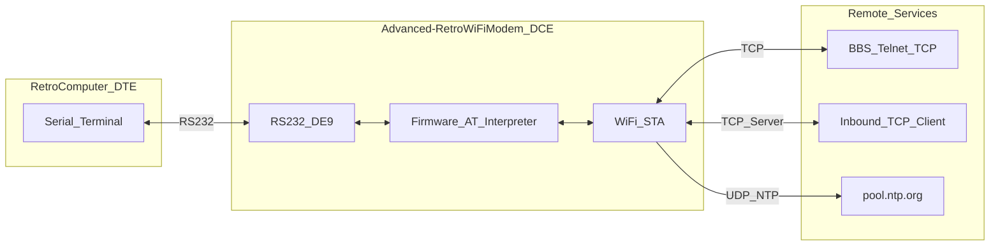
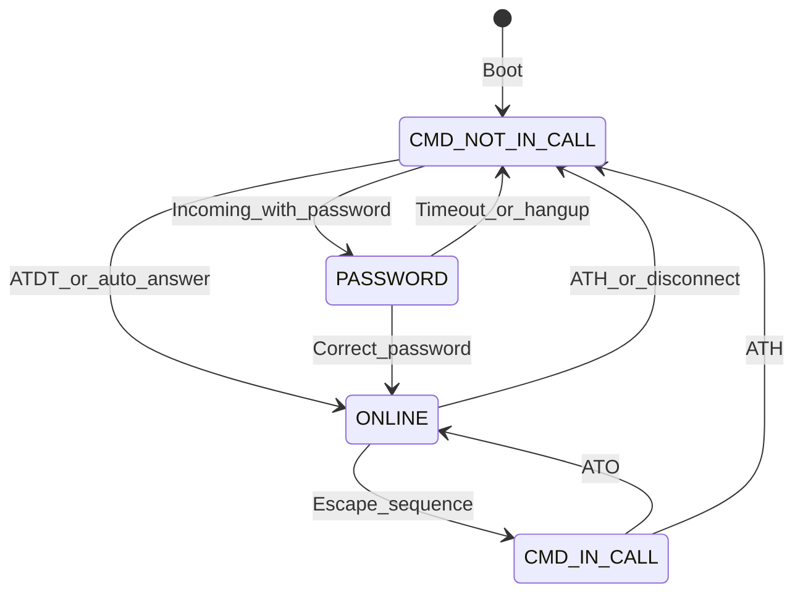
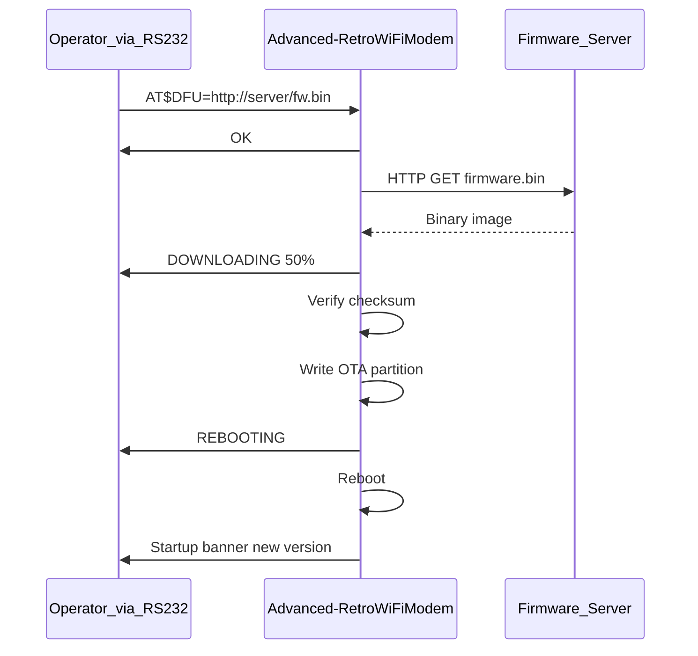
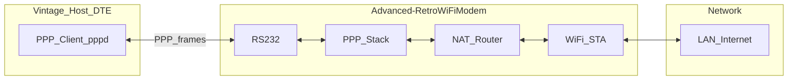

# Requirements Specification — Advanced Retro WiFi Modem

| Field | Value |
|-------|-------|
| **Document** | Requirements Specification |
| **Product** | Advanced Retro WiFi Modem |
| **Repository** | [oe3gwu/Advanced-RetroWiFiModem](https://github.com/oe3gwu/Advanced-RetroWiFiModem) |
| **Version** | 1.2 (DFU and PPP implemented in firmware, branch `ai`) |
| **Language** | English |
| **License** | GNU GPL v3 |

---

## 1. Introduction

### 1.1 Purpose

This document specifies the functional and non-functional requirements for the **Advanced Retro WiFi Modem** — an embedded RS-232 Hayes modem emulator that connects vintage computers to modern TCP/IP services over WiFi.

The specification is derived from the current repository (firmware, hardware, and documentation). Where features are advertised or planned but not yet implemented, they are explicitly marked **Planned**.

### 1.2 Scope

This specification covers:

- Wemos PCB in `kicad/wemos/` (KiCad, Gerbers, BOM) — **shared by Wemos D1 mini and Wemos C3 Mini** (layout originally for ESP8266)
- `firmware/wemos-d1-mini/` — ESP8266 on Wemos D1 mini
- `firmware/wemos-c3-mini/` — ESP32-C3 on Wemos C3 Mini (same PCB, drop-in)
- `firmware/esp32-wroom-da/` — ESP32-WROOM-DA bring-your-own hardware (**no PCB in repo, none planned**)
- RS-232 modem emulation, AT command interface, and session management
- Planned extensions: Device Firmware Update (DFU) and Point-to-Point Protocol (PPP)

### 1.3 Target Audience

- Firmware and hardware developers
- Operators configuring retro systems
- Retro-computing enthusiasts using serial terminals and BBS software

### 1.4 Product Summary

The Advanced Retro WiFi Modem presents itself as a **Data Circuit-terminating Equipment (DCE)** Hayes modem to a vintage **Data Terminal Equipment (DTE)**. Instead of dialling a phone number, it establishes TCP connections over WiFi to BBS hosts, Telnet servers, or other TCP services.

The device supports:

- Full DE-9 RS-232 with control lines (TxD, RxD, RTS, CTS, DSR, DTR, DCD, RI)
- Hayes AT commands (WiFi232 style)
- Outbound TCP dial, inbound TCP server, Telnet handling
- Configuration persistence in NVRAM (EEPROM)

### 1.5 References

| Reference | Location |
|-----------|----------|
| User documentation | [`README.md`](../README.md) |
| License | [`LICENSE.txt`](../LICENSE.txt) |
| Wemos D1 mini firmware | [`firmware/wemos-d1-mini/Advanced-RetroWiFiModem/`](../firmware/wemos-d1-mini/Advanced-RetroWiFiModem/) |
| Wemos C3 Mini firmware | [`firmware/wemos-c3-mini/Advanced-RetroWiFiModem/`](../firmware/wemos-c3-mini/Advanced-RetroWiFiModem/) |
| ESP32-WROOM-DA firmware | [`firmware/esp32-wroom-da/Advanced-RetroWiFiModem/`](../firmware/esp32-wroom-da/Advanced-RetroWiFiModem/) |
| KiCad hardware (Wemos PCB) | [`kicad/wemos/`](../kicad/wemos/) |
| Hayes AT command set | Industry standard (WiFi232-compatible subset) |
| Telnet | RFC 854 (subset implemented) |
| NTP | UDP port 123, `pool.ntp.org` |

### 1.6 Implementation Status Legend

| Status | Meaning |
|--------|---------|
| **Implemented** | Present and functional in the current codebase |
| **Partial** | Partially implemented or developer-only workflow |
| **Planned** | Required by product vision; not yet in code |
| **Out of Scope** | Explicitly excluded |

### 1.7 Platform Fit Legend

Each requirement is tagged for **Wemos D1 mini (ESP8266)**, **Wemos C3 Mini (ESP32-C3)** on the shared Wemos PCB, and **ESP32-WROOM-DA** (bring-your-own hardware):

| Fit | Meaning |
|-----|---------|
| **Full** | Requirement applies in full on this platform |
| **Limited** | Subset or constrained implementation is acceptable (details in requirement text) |
| **Partial** | Partially met today (e.g. developer-only OTA) |
| **Planned** | Not implemented; target for future firmware |
| **N/A** | Not applicable to this platform |

---

## 2. Definitions and Abbreviations

| Term | Definition |
|------|------------|
| **AT** | Attention command prefix for Hayes modem control |
| **BBS** | Bulletin Board System |
| **DCE** | Data Circuit-terminating Equipment (the modem) |
| **DFU** | Device Firmware Update — end-user firmware upgrade without developer tools |
| **DTE** | Data Terminal Equipment (the retro computer/terminal) |
| **NVRAM** | Non-volatile configuration storage (EEPROM/flash) |
| **OTA** | Over-the-Air update (Arduino IDE network upload) |
| **PPP** | Point-to-Point Protocol — serial link carrying IP frames |
| **Command Mode** | AT commands accepted; no transparent data bridge |
| **Online Mode** | Transparent serial ↔ network data transfer |
| **Carrier** | Active TCP session, indicated by DCD and `CONNECT` |
| **Speed Dial** | Stored host:port shortcut with optional alias |
| **Telnet (real)** | Full Telnet framing: IAC escape, CR/NUL handling |
| **Telnet (fake)** | BBS-oriented Telnet: IAC doubling only |
| **Guard Time** | Pause before/after escape sequence (`+++`) |

---

## 3. System Overview

### 3.1 Architecture



### 3.2 Product Variants

| Variant | Firmware | Hardware | Status |
|---------|----------|----------|--------|
| **Wemos D1 mini** | `firmware/wemos-d1-mini/` | Shared `kicad/wemos/` PCB | Implemented |
| **Wemos C3 Mini** | `firmware/wemos-c3-mini/` | Same `kicad/wemos/` PCB (drop-in) | Implemented |
| **ESP32-WROOM-DA** | `firmware/esp32-wroom-da/` | User-supplied (GPIO map in header) | Implemented (firmware only; **no PCB planned**) |

### 3.3 Platform Resources and Constraints

| Resource | Wemos D1 mini (ESP8266) | Wemos C3 Mini (ESP32-C3) | ESP32-WROOM-DA |
|----------|-------------------------|--------------------------|----------------|
| Typical flash | 4 MB (OTA layout required) | 4 MB | 4 MB+ (module-dependent) |
| OTA app partition | ~1 MB (see README flash size setting) | Larger headroom typical | Larger headroom typical |
| Free heap (typical, runtime) | ~40–50 KB after WiFi connect | ~200 KB+ | ~200 KB+ |
| Wemos PCB in repo (`kicad/wemos/`) | Yes | Yes (same board) | No |
| EEPROM | `ESP_EEPROM` + `eeprom_storage.h` | Built-in `EEPROM.h` | Built-in `EEPROM.h` |
| PPP / NAT | **Not supported** (stub) | Supported | Supported |
| DFU feasibility | Yes with flash/RAM discipline | Yes with margin | Yes with margin |

**Implication:** All **implemented** features fit both platforms today. **Planned** DFU fits both; **planned** PPP is split into an **ESP32 full profile** and an **ESP8266 limited profile** (see §5.2).

### 3.4 Actors

| Actor | Role |
|-------|------|
| Retro terminal (DTE) | Sends AT commands and session data over RS-232 |
| Operator | Configures modem via terminal emulator |
| Remote TCP server | Target of outbound dial (BBS, Telnet) |
| Remote TCP client | Connects to inbound TCP server on modem |
| Developer | Flashes firmware via USB or Arduino OTA |

### 3.5 Session State Machine



| State | Description |
|-------|-------------|
| `CMD_NOT_IN_CALL` | Command mode, no active session |
| `CMD_IN_CALL` | Command mode while TCP connection remains open |
| `ONLINE` | Transparent data bridge active |
| `PASSWORD` | Inbound caller must enter server password |

---

## 4. Functional Requirements — Implemented

Unless noted otherwise, all implemented requirements below are **Full** on both ESP8266 and ESP32. Exceptions: **FR-HW** is ESP8266 only; **FR-OTA** is **Partial** on both (developer workflow).

### 4.1 Serial Interface (FR-Serial)

| ID | Requirement | ESP8266 | ESP32 | Status |
|----|-------------|---------|-------|--------|
| FR-SERIAL-01 | Provide DE-9 RS-232 with TxD, RxD, RTS, CTS, DSR, DTR, DCD, RI | Full | Full | Implemented |
| FR-SERIAL-02 | Support baud rates: 110 … 115200 (see `AT$SB`) | Full | Full | Implemented |
| FR-SERIAL-03 | Default baud rate shall be 1200 | Full | Full | Implemented |
| FR-SERIAL-04 | Configurable data format via `AT$SU` | Full | Full | Implemented |
| FR-SERIAL-05 | Hardware flow control RTS/CTS via `AT&K1` | Full | Full | Implemented |
| FR-SERIAL-06 | Assert DCD when carrier (TCP session) is active | Full | Full | Implemented |
| FR-SERIAL-07 | Assert DSR when WiFi connected and modem ready | Full | Full | Implemented |
| FR-SERIAL-08 | Drive RI and `RING` on inbound TCP connections | Full | Full | Implemented |

### 4.2 AT Command Interpreter (FR-AT)

| ID | Requirement | Status |
|----|-------------|--------|
| FR-AT-01 | Accept Hayes-compatible AT commands over RS-232 | Implemented |
| FR-AT-02 | Support multiple commands per line (e.g. `ATS0=1Q0V1`) | Implemented |
| FR-AT-03 | Support query form with `?` suffix on configurable commands | Implemented |
| FR-AT-04 | Return standard result codes: `OK`, `ERROR`, `CONNECT`, `NO CARRIER`, `RING`, `NO ANSWER` | Implemented |
| FR-AT-05 | Provide built-in help via `AT?` with paged output | Implemented |
| FR-AT-06 | Support command repeat via `A/` | Implemented |
| FR-AT-07 | String arguments (`AT$SSID=`, etc.) must be last on the command line | Implemented |

### 4.3 WiFi Management (FR-WiFi)

| ID | Requirement | Status |
|----|-------------|--------|
| FR-WIFI-01 | Store WiFi SSID via `AT$SSID=` (max 32 characters) | Implemented |
| FR-WIFI-02 | Store WiFi password via `AT$PASS=` (max 64 characters) | Implemented |
| FR-WIFI-03 | Connect to WiFi via `ATC1`; disconnect via `ATC0` | Implemented |
| FR-WIFI-04 | Report connection status via `ATC?` (0/1) | Implemented |
| FR-WIFI-05 | Display network information via `ATI` (IP, MAC, SSID, heap, call stats) | Implemented |
| FR-WIFI-06 | Operate in WiFi station (STA) mode | Implemented |

### 4.4 Outbound Connection (FR-Dial)

| ID | Requirement | Status |
|----|-------------|--------|
| FR-DIAL-01 | Dial TCP host via `ATDT[prefix]host[:port]` | Implemented |
| FR-DIAL-02 | Default TCP port shall be 23 if not specified | Implemented |
| FR-DIAL-03 | Support speed dial slots 0–9 via `ATDSn` | Implemented |
| FR-DIAL-04 | Support speed dial aliases and `AT&Zn=host[:port],alias` | Implemented |
| FR-DIAL-05 | Support 7-digit magic dial (e.g. `7777777` → slot 7) | Implemented |
| FR-DIAL-06 | Telnet mode prefix on dial: `-` = off, `=` = real, `+` = fake | Implemented |
| FR-DIAL-07 | On success: return `CONNECT`, assert DCD, enter online mode | Implemented |
| FR-DIAL-08 | On failure: return `NO CARRIER`, deassert DCD | Implemented |

### 4.5 Inbound Server (FR-Server)

| ID | Requirement | Status |
|----|-------------|--------|
| FR-SERVER-01 | Listen on configurable TCP port via `AT$SP=n` (0 = disabled) | Implemented |
| FR-SERVER-02 | Emit `RING` on serial when inbound connection arrives | Implemented |
| FR-SERVER-03 | Answer call manually via `ATA` | Implemented |
| FR-SERVER-04 | Auto-answer after n rings via `ATS0=n` | Implemented |
| FR-SERVER-05 | Optional server password via `AT&R=`; prompt caller in `PASSWORD` state | Implemented |
| FR-SERVER-06 | Reject callers with busy message `AT$BM=` when appropriate | Implemented |
| FR-SERVER-07 | Allow up to 3 password attempts; 60 s timeout | Implemented |

### 4.6 Session Management (FR-Session)

| ID | Requirement | Status |
|----|-------------|--------|
| FR-SESSION-01 | Bridge serial data bidirectionally to TCP in online mode | Implemented |
| FR-SESSION-02 | Return to command mode via escape sequence (`+++` with guard time) | Implemented |
| FR-SESSION-03 | Configurable escape character via `ATS2=n` (≥128 disables) | Implemented |
| FR-SESSION-04 | Hang up via `ATH` / `ATH0` | Implemented |
| FR-SESSION-05 | Return to online mode via `ATO` if connection still open | Implemented |
| FR-SESSION-06 | DTR handling: `AT&D0` ignore, `AT&D1` go offline, `AT&D2` hang up, `AT&D3` reset | Implemented |
| FR-SESSION-07 | Track bytes in/out and connection duration | Implemented |

### 4.7 Telnet (FR-Telnet)

| ID | Requirement | Status |
|----|-------------|--------|
| FR-TELNET-01 | Global Telnet mode: `ATNET0` off, `ATNET1` real, `ATNET2` fake | Implemented |
| FR-TELNET-02 | Per-dial Telnet override via dial prefix | Implemented |
| FR-TELNET-03 | Negotiate BINARY, ECHO, SUP_GA, TTYPE, TSPEED, LOC, NAWS | Implemented |
| FR-TELNET-04 | Configure terminal type `AT$TTY=`, location `AT$TTL=`, size `AT$TTS=WxH` | Implemented |
| FR-TELNET-05 | Send Telnet AYT via `AT$AYT` | Implemented |

### 4.8 Configuration Persistence (FR-NVRAM)

| ID | Requirement | Status |
|----|-------------|--------|
| FR-NVRAM-01 | Persist settings struct to EEPROM | Implemented |
| FR-NVRAM-02 | Save current settings via `AT&W` | Implemented |
| FR-NVRAM-03 | Restore factory defaults via `AT&F` | Implemented |
| FR-NVRAM-04 | Display active settings `AT&V0` or stored `AT&V1` | Implemented |
| FR-NVRAM-05 | Restart device via `ATZ` | Implemented |
| FR-NVRAM-06 | Validate EEPROM with platform magic number | Implemented |

### 4.9 Time, HTTP, and Network Services

| ID | Requirement | Status |
|----|-------------|--------|
| FR-TIME-01 | Query UTC date/time via NTP (`ATRD` / `ATRT`) from `pool.ntp.org` | Implemented |
| FR-HTTP-01 | HTTP GET via `ATGEThttp://host[/path]` (plain HTTP only) | Implemented |
| FR-MDNS-01 | Configurable mDNS hostname via `AT$MDNS=` (default `espmodem` / `esp32modem`) | Implemented |
| FR-STARTUP-01 | Auto-execute AT command on boot via `AT$AE=` | Implemented |
| FR-STARTUP-02 | Optional startup wait for CR via `AT$W=1` | Implemented |

### 4.12 RAW Transparent Mode (FR-RAW) — ESP32 only

**Status: Experimental** — `firmware/wemos-c3-mini/` and `firmware/esp32-wroom-da/` (`raw_mode.h`)

Persistent dataset-style mode for vintage DTEs without Hayes command support.

| ID | Requirement | ESP8266 | ESP32 | Status |
|----|-------------|---------|-------|--------|
| FR-RAW-01 | Persist operating mode AT/RAW in NVRAM (`operationMode`) | N/A | Full | Experimental |
| FR-RAW-02 | RAW: DTR assert dials Speed-Dial slot 0; no Hayes on serial | N/A | Full | Experimental |
| FR-RAW-03 | RAW: No text result codes — DCD/RI/DSR only | N/A | Full | Experimental |
| FR-RAW-04 | RAW: Maintenance window after DTR inactive 5 s; 120 s AT acceptance | N/A | Full | Experimental |
| FR-RAW-05 | `AT$MODE=AT`/`RAW` saves immediately; AT←RAW switch is manual | N/A | Full | Experimental |
| FR-RAW-06 | Boot: full WiFi banner in AT and RAW; mode-specific lines | N/A | Full | Experimental |
| FR-RAW-07 | Boot RAW documents return path (5 s + 120 s window + `AT$MODE=AT`) | N/A | Full | Experimental |
| FR-RAW-08 | RAW labelled **experimental** in banner, docs, and `AT$MODE=RAW` | N/A | Full | Experimental |

### 4.10 Developer OTA (FR-OTA)

| ID | Requirement | ESP8266 | ESP32 | Status |
|----|-------------|---------|-------|--------|
| FR-OTA-01 | Arduino IDE network upload when WiFi connected | Partial | Partial | Partial |
| FR-OTA-02 | OTA hostname matches mDNS name | Full | Full | Implemented |
| FR-OTA-03 | OTA not operable via AT commands from RS-232 | Full | Full | Implemented |

> **Note:** FR-OTA is developer-only on both platforms. End users need **FR-DFU** (§5.1).

### 4.11 ESP8266 Hardware (FR-HW)

| ID | Requirement | ESP8266 | ESP32 | Status |
|----|-------------|---------|-------|--------|
| FR-HW-01 | PCB accepts Wemos D1 mini (ESP8266) | Full | N/A | Implemented |
| FR-HW-02 | RS-232 level shifting via MAX3237 | Full | N/A | Implemented |
| FR-HW-03 | Status LEDs via 74HCT245 | Full | N/A | Implemented |
| FR-HW-04 | Boot TX masking via 74HC32 and TXEN | Full | N/A | Implemented |
| FR-HW-05 | 3.3 V regulator LM2931 | Full | N/A | Implemented |
| FR-HW-06 | Power: 5 V barrel jack 2.1 × 5.5 mm | Full | N/A | Implemented |
| FR-HW-07 | Production Gerber files provided | Full | N/A | Implemented |

> **ESP32-WROOM-DA:** User supplies hardware with RS-232 level shifter (e.g. MAX3237) and GPIO wiring per `firmware/esp32-wroom-da/Advanced-RetroWiFiModem/Advanced-RetroWiFiModem.h`. **No PCB in this repository.**

---

## 5. Functional Requirements — Planned

### 5.1 Device Firmware Update (FR-DFU)

**Status: Implemented** in `dfu.h` and `xmodem.h` (ESP8266 and ESP32)

**Rationale:** On the Wemos board the module USB port is internal. End users interact via DE-9 and WiFi only. DFU via AT commands is required on **all** firmware variants.

**Distinction from FR-OTA:** `ArduinoOTA` in `support.h` requires Arduino IDE and is not accessible from RS-232.

#### 5.1.1 Common DFU Requirements (both platforms)

| ID | Requirement | ESP8266 | ESP32 | Status |
|----|-------------|---------|-------|--------|
| FR-DFU-01 | Initiate update from command mode (`AT$DFU=http://host/fw.bin`; `AT$DFU?` for status) | Planned | Planned | Planned |
| FR-DFU-02 | Download firmware over WiFi/HTTP (no TLS in v1) | Planned | Planned | Planned |
| FR-DFU-04 | Validate image before flash (CRC32 minimum; SHA-256 recommended) | Planned | Planned | Planned |
| FR-DFU-05 | Write to OTA partition; reboot on success | Planned | Planned | Planned |
| FR-DFU-06 | Report progress on serial (`DOWNLOADING n%`, `VERIFYING`, `FLASHING`, `REBOOTING`) | Planned | Planned | Planned |
| FR-DFU-07 | On failure: abort with `ERROR`; keep running firmware | Planned | Planned | Planned |
| FR-DFU-08 | Reject DFU in online mode or active TCP session | Planned | Planned | Planned |
| FR-DFU-09 | Preserve NVRAM when `Settings` struct unchanged | Planned | Planned | Planned |

#### 5.1.2 Platform-Specific DFU Requirements

| ID | Requirement | ESP8266 | ESP32 | Status |
|----|-------------|---------|-------|--------|
| FR-DFU-03 | Serial fallback via XMODEM/YMODEM over RS-232 | **Limited** — optional; recommended for field use without HTTP server | **Full** — optional but supported | Planned |
| FR-DFU-10 | Platform-appropriate flash layout and image size | **Limited** — image must fit OTA slot (~1 MB); monitor sketch growth | **Full** — larger OTA partition typical | Planned |
| FR-DFU-11 | Stream download to flash without large RAM buffer | **Full** — mandatory (heap ~40–50 KB) | **Full** — mandatory for robustness | Planned |
| FR-DFU-12 | DFU binary format documented per platform | **Full** — `esp8266` `.bin` from Arduino build | **Full** — `esp32` `.bin` from Arduino build | Planned |

**ESP8266 DFU constraints:**

- Flash size **4 MB with OTA partition** required (README: e.g. *4MB (FS:2MB OTA:~1019KB)*).
- No HTTPS/TLS in v1 — keeps RAM and flash headroom.
- HTTP download must use **streaming write** to OTA partition, not full-image RAM buffer.
- XMODEM is valuable when no HTTP firmware server is available.

**ESP32 DFU constraints:**

- Same safety rules as ESP8266; more margin for future features.
- Prefer `esp_ota_ops` / `Update` API with dual-partition layout.

**Proposed DFU sequence:**



**Current implementation gap (both platforms):**

- Only `ArduinoOTA` in `support.h` — no `AT$DFU`
- No XMODEM/YMODEM receiver
- `ATGET` bridges HTTP to serial only; no flash pipeline

### 5.2 Point-to-Point Protocol (FR-PPP)

**Status: Implemented** in `ppp.h` when lwIP `pppos` is available (ESP32 full profile; ESP8266 limited profile)

**Rationale:** Startup banner in `Advanced-RetroWiFiModem.ino` advertises *"AT and PPP Support"* but no PPP code exists. PPP is needed for vintage dial-up IP (`pppd`, Windows Dial-Up Networking). BBS/Telnet users can continue using `ATDT` without PPP.

| Use Case | AT + TCP (`ATDT`) | PPP |
|----------|-------------------|-----|
| BBS / Telnet terminal | Sufficient | Not required |
| Vintage OS dial-up IP | Insufficient | **Required** |
| Full IP stack over serial | Insufficient | **Required** |

#### 5.2.1 ESP32 — Full PPP Profile (target platform)

All requirements below are **Planned** with **Full** fit on ESP32:

| ID | Requirement |
|----|-------------|
| FR-PPP-01 | Enter PPP mode via `ATD*99#` or `AT$PPP=1` from command mode |
| FR-PPP-02 | Terminate PPP on RS-232; **NAT/routing** to WiFi LAN/internet |
| FR-PPP-03 | LCP, **PAP and CHAP**, IPCP for address assignment |
| FR-PPP-04 | Configurable peer IP pool (e.g. `192.168.240.0/24`) |
| FR-PPP-05 | DNS and gateway via IPCP options |
| FR-PPP-06 | Mutually exclusive with `ATDT` TCP mode; one online mode at a time |
| FR-PPP-07 | Terminate via `ATH` or DTR per `AT&D` |
| FR-PPP-08 | lwIP `pppos` (or equivalent) on ESP32 |
| FR-PPP-09 | Windows 9x Dial-Up Networking at 9600–115200 baud |
| FR-PPP-10 | Linux `pppd` link-up, ping and TCP through NAT |

#### 5.2.2 ESP8266 — Limited PPP Profile

On ESP8266, full PPP+NAT is **resource-constrained**. The following **Limited** profile is the realistic target:

| ID | Requirement | Notes |
|----|-------------|-------|
| FR-PPP-L01 | Enter PPP via `ATD*99#` | Same dial string as classic modems |
| FR-PPP-L02 | PPP on RS-232 with **basic NAT** to WiFi | Single-peer focus; best-effort throughput |
| FR-PPP-L03 | LCP, **PAP only** (no CHAP) | Saves flash/RAM |
| FR-PPP-L04 | Fixed peer IP (e.g. `192.168.240.2`) via IPCP | No large address pool |
| FR-PPP-L05 | Gateway via IPCP; DNS optional or fixed | DNS may be omitted in v1 |
| FR-PPP-L06 | Mutually exclusive with `ATDT` TCP mode | Same as FR-PPP-06 |
| FR-PPP-L07 | Terminate via `ATH` or DTR | Same as FR-PPP-07 |
| FR-PPP-L08 | Recommended serial speed ≤ 57600 during PPP | Reduces watchdog/flow-control pressure |
| FR-PPP-L09 | `pppd` link-up and ping to gateway | Minimum acceptance for Limited profile |
| FR-PPP-L10 | Windows DUN | **Not required** for ESP8266 Limited profile |

**ESP8266 PPP risks (documented):**

- Low free heap alongside WiFi + PPP + NAT
- Existing watchdog sensitivity with `AT&K1` and long RTS hold
- Arduino ESP8266 lwIP PPP support less mature than ESP32

**ESP32** shall implement the **Full** profile (§5.2.1). **ESP8266** shall implement at minimum the **Limited** profile (§5.2.2). If Limited cannot be met, PPP on ESP8266 may be deferred with banner text updated accordingly.

**Proposed PPP architecture (ESP32 full profile):**



**Current implementation gap (both platforms):**

- Banner only — no `pppos`, no NAT, no PPP state in main loop

### 5.3 Planned Features — Platform Summary

| Feature | Wemos D1 mini | Wemos C3 Mini | ESP32-WROOM-DA |
|---------|---------------|---------------|----------------|
| DFU via HTTP (`AT$DFU`) | Implemented | Implemented | Implemented |
| DFU via XMODEM | Implemented | Implemented | Implemented |
| PPP + NAT | **Not supported** | Implemented | Implemented |
| PPP CHAP / Windows DUN | N/A | Planned | Planned |
| Wemos PCB in repo | Yes | Yes (same board) | No (BYO) |

---

## 6. Out of Scope

| Item | Reason |
|------|--------|
| HTTPS/TLS | Not implemented; HTTP only |
| Baud-rate auto-detection | User must match `AT$SB` to terminal |
| DFPlayer Mini on PCB | Hardware present; not firmware-controlled |
| Web UI / mobile app | No management interface beyond AT commands |
| Cloud backend | Standalone embedded device |
| ESP8266 full PPP + CHAP + Windows DUN | Limited profile only; see §5.2.2 |
| HTTPS DFU | RAM/flash constraints; HTTP only in v1 |

---

## 7. Non-Functional Requirements

| ID | Requirement | ESP8266 | ESP32 |
|----|-------------|---------|-------|
| NFR-LICENSE-01 | Software under GNU GPL v3 | Implemented | Implemented |
| NFR-PLATFORM-01 | Build with Arduino IDE | Implemented | Implemented |
| NFR-PLATFORM-02 | Board core / EEPROM libs per README | Implemented | Implemented |
| NFR-PERSIST-01 | Platform-specific EEPROM magic | `0x4321` | `0x4322` |
| NFR-PERSIST-02 | Settings not portable across platforms | Full | Full |
| NFR-COMPAT-01 | Wemos PCB fits D1 mini and C3 Mini only; not WROOM-DA module | N/A | N/A | N/A |
| NFR-RELIABILITY-01 | `yield()` in UART loop under RTS/CTS | Implemented | Implemented |
| NFR-SECURITY-01 | Server password plain text only | Implemented | Implemented |
| NFR-DFU-SAFETY-01 | Dual-partition OTA; safe abort on failure | Planned | Planned |
| NFR-DFU-UX-01 | DFU via RS-232 + WiFi only | Planned | Planned |
| NFR-DFU-FLASH-01 | Image ≤ OTA slot (~1 MB) | Planned | N/A |
| NFR-DFU-RAM-01 | Stream download to flash | Planned | Planned |
| NFR-PPP-COMPAT-01 | `pppd` at supported baud rates | Limited | Full |
| NFR-PPP-PERF-01 | AT/TCP unaffected when PPP inactive | Planned | Planned |
| NFR-PPP-RAM-01 | Limited PPP fits available heap | Planned | N/A |

---

## 8. Interfaces

### 8.1 Hardware — Wemos D1 mini GPIO Mapping

Defined in `firmware/wemos-d1-mini/Advanced-RetroWiFiModem/Advanced-RetroWiFiModem.h` (Wemos D1 mini on shared Wemos PCB):

| Signal | GPIO | D1 Pin | Direction (modem/DCE) |
|--------|------|--------|------------------------|
| Serial TX | 1 | Tx | Output (via MAX3237, OR gate) |
| Serial RX | 3 | Rx | Input |
| DSR | 4 | D2 | Output |
| DCD | 5 | D1 | Output |
| DTR | 0 | D3 | Input |
| TXEN | 14 | D5 | Output (boot mask) |
| RI | 12 | D6 | Output |
| RTS | 13 | D7 | Input |
| CTS | 15 | D8 | Output |

Control signals are **active low**.

### 8.2 Hardware — Wemos C3 Mini GPIO Mapping

Defined in `firmware/wemos-c3-mini/Advanced-RetroWiFiModem/Advanced-RetroWiFiModem.h` (Wemos C3 Mini on the **same** `kicad/wemos/` PCB; GPIO numbers differ from D1 mini at each D-pin position):

| Signal | GPIO | D-pin | Direction (modem/DCE) |
|--------|------|-------|------------------------|
| Serial TX | 21 | Tx | Output (via MAX3237, OR gate) |
| Serial RX | 20 | Rx | Input |
| DSR | 8 | D2 | Output |
| DCD | 10 | D1 | Output |
| DTR | 7 | D3 | Input |
| TXEN | 1 | D5 | Output (boot mask) |
| RI | 0 | D6 | Output |
| RTS | 4 | D7 | Input |
| CTS | 5 | D8 | Output |

Control signals are **active low**.

### 8.3 Hardware — ESP32-WROOM-DA GPIO Mapping (bring-your-own)

Defined in `firmware/esp32-wroom-da/Advanced-RetroWiFiModem/Advanced-RetroWiFiModem.h` (30-pin ESP32-WROOM-DA dev board; **not** the Wemos PCB):

| Signal | GPIO | Direction (modem/DCE) |
|--------|------|------------------------|
| Serial TX/RX | UART default | Via MAX3237 or equivalent |
| DSR | 4 | Output |
| DCD | 5 | Output |
| DTR | 34 | Input (input-only pin; GPIO0 is not available on 30-pin dev boards) |
| TXEN | 14 | Output (boot mask) |
| RI | 12 | Output |
| RTS | 13 | Input |
| CTS | 15 | Output |

### 8.4 AT Command Interface

#### Result Codes

| Code | Meaning |
|------|---------|
| `OK` | Command accepted |
| `ERROR` | Command rejected |
| `CONNECT` | Session established |
| `NO CARRIER` | Connection failed or ended |
| `RING` | Inbound call waiting |
| `NO ANSWER` | Inbound call not answered |

#### Command Reference (Implemented)

| Command | Description |
|---------|-------------|
| `AT` | Ready check |
| `AT?` | Help (paged) |
| `A/` | Repeat last command |
| `ATA` | Answer inbound call |
| `ATC0` / `ATC1` / `ATC?` | WiFi disconnect / connect / status |
| `ATDT[+-=]host[:port]` | Dial TCP host |
| `ATDSn` | Speed dial slot n (0–9) |
| `ATE0` / `ATE1` / `ATE?` | Command echo off/on/query |
| `ATGEThttp://host[/path]` | HTTP GET (no TLS) |
| `ATH` | Hang up |
| `ATI` | Network and modem info |
| `ATNET0` / `1` / `2` / `?` | Telnet mode off/real/fake/query |
| `ATO` | Return to online mode |
| `ATQ0` / `ATQ1` / `ATQ?` | Quiet mode |
| `ATRD` / `ATRT` | UTC date/time via NTP |
| `ATS0=n` / `ATS0?` | Auto-answer rings |
| `ATS2=n` / `ATS2?` | Escape character |
| `ATV0` / `ATV1` / `ATV?` | Verbose result codes |
| `ATX0` / `ATX1` / `ATX?` | Extended result codes |
| `ATZ` | Restart modem |
| `AT&D0`–`AT&D3` / `AT&D?` | DTR handling |
| `AT&F` | Factory defaults |
| `AT&K0` / `AT&K1` / `AT&K?` | RTS/CTS flow control |
| `AT&R=` / `AT&R?` | Server password |
| `AT&V0` / `AT&V1` | Show active / stored settings |
| `AT&W` | Save settings to NVRAM |
| `AT&Zn=` / `AT&Zn?` | Speed dial slot n |
| `AT$AE=` / `AT$AE?` | Auto-execute on startup |
| `AT$AYT` | Telnet "Are You There" |
| `AT$BM=` / `AT$BM?` | Busy message |
| `AT$MDNS=` / `AT$MDNS?` | mDNS hostname |
| `AT$PASS=` / `AT$PASS?` | WiFi password |
| `AT$SB=` / `AT$SB?` | Serial baud rate |
| `AT$SP=` / `AT$SP?` | TCP listen port |
| `AT$SSID=` / `AT$SSID?` | WiFi SSID |
| `AT$SU=` / `AT$SU?` | Serial format (e.g. `8N1`) |
| `AT$TTL=` / `AT$TTL?` | Telnet location |
| `AT$TTS=` / `AT$TTS?` | Terminal size WxH |
| `AT$TTY=` / `AT$TTY?` | Terminal type |
| `AT$W=` / `AT$W?` | Startup wait for CR |
| `AT$MODE=AT` / `AT$MODE=RAW` / `AT$MODE?` | Operating mode (RAW experimental, ESP32) |
| `+++` | Escape to command mode (online, with guard time) |

#### Planned AT Commands

| Command | Description | ESP8266 | ESP32 | Status |
|---------|-------------|---------|-------|--------|
| `AT$DFU=http://…` | HTTP firmware download and flash | Planned | Planned | Planned |
| `AT$DFU?` | DFU status | Planned | Planned | Planned |
| `ATD*99#` / `AT$PPP=1` | Enter PPP mode | Limited profile | Full profile | Planned |

### 8.5 TCP Interface

| Mode | Port | Description |
|------|------|-------------|
| Client | User-specified (default 23) | Outbound dial via `ATDT` |
| Server | `AT$SP` (0 = off) | Inbound connections, `RING`/`ATA` |

### 8.6 External Services

| Service | Protocol | Usage | Status |
|---------|----------|-------|--------|
| WiFi | 802.11 STA | Network access | Implemented |
| DNS | Via WiFi stack | Hostname resolution | Implemented |
| NTP | UDP → `pool.ntp.org:123` | `ATRD`/`ATRT` | Implemented |
| mDNS | `.local` hostname | OTA discovery | Implemented |
| Arduino OTA | Espressif OTA | Developer firmware upload | Partial |
| HTTP firmware server | HTTP | DFU image download | Planned |

---

## 9. Data Model

### 9.1 Settings Structure (NVRAM)

Persisted in EEPROM as `struct Settings` (`globals.h`):

| Field | Type | Max / Values |
|-------|------|--------------|
| `magicNumber` | uint16 | ESP8266: `0x4321`, ESP32: `0x4322` |
| `ssid` | char[] | 32 + NUL |
| `wifiPassword` | char[] | 64 + NUL |
| `serialSpeed` | uint32 | See FR-SERIAL-02 |
| `dataBits` | uint8 | 5–8 |
| `parity` | char | N, E, O |
| `stopBits` | uint8 | 1, 2 |
| `rtsCts` | bool | Hardware flow control |
| `width`, `height` | uint8 | Telnet terminal size |
| `escChar` | char | Escape character (0–127; ≥128 disabled) |
| `alias[10]` | char[][] | 16 + NUL per slot |
| `speedDial[10]` | char[][] | 50 + NUL per slot |
| `mdnsName` | char[] | 80 + NUL |
| `autoAnswer` | uint8 | Ring count before auto-answer |
| `listenPort` | uint16 | TCP server port |
| `busyMsg` | char[] | 80 + NUL |
| `serverPassword` | char[] | 80 + NUL |
| `echo` | bool | Command echo |
| `telnet` | uint8 | 0=off, 1=real, 2=fake |
| `autoExecute` | char[] | 80 + NUL |
| `terminal` | char[] | 80 + NUL |
| `location` | char[] | 80 + NUL |
| `startupWait` | bool | Wait for CR on boot |
| `extendedCodes` | bool | Extended result text |
| `verbose` | bool | Text vs numeric results |
| `quiet` | bool | Suppress result codes |
| `dtrHandling` | enum | 0–3 (ignore/offline/hangup/reset) |
| `operationMode` | uint8 | 0=AT (default), 1=RAW experimental (ESP32 only) |

### 9.2 Factory Defaults

| Parameter | Default |
|-----------|---------|
| Baud rate | 1200 |
| Data format | 8N1 |
| Telnet mode | Real (`ATNET1`) |
| mDNS name | `espmodem` (ESP8266) / `esp32modem` (ESP32) |
| Listen port | 0 (disabled) |
| DTR handling | Ignore |
| RTS/CTS | Off |
| Speed dial 0 | `particles` → `+particlesbbs.dyndns.org:6400` |
| Speed dial 1 | `altair` → `altair.virtualaltair.com:4667` |
| Speed dial 2 | `heatwave` → `heatwave.ddns.net:9640` |

---

## 10. Implementation Status / Traceability Matrix

### 10.1 Feature-Level Matrix

| Requirement | ESP8266 | ESP32 | Code Status | Evidence |
|-------------|---------|-------|-------------|----------|
| FR-Serial | Full | Full | Implemented | `Advanced-RetroWiFiModem.h`, `support.h` |
| FR-AT | Full | Full | Implemented | `at_*.h` |
| FR-WiFi | Full | Full | Implemented | `at_basic.h`, `at_proprietary.h` |
| FR-Dial | Full | Full | Implemented | `at_basic.h` |
| FR-Server | Full | Full | Implemented | `support.h`, `at_proprietary.h` |
| FR-Session | Full | Full | Implemented | `support.h`, `Advanced-RetroWiFiModem.ino` |
| FR-Telnet | Full | Full | Implemented | `support.h`, `at_basic.h` |
| FR-NVRAM | Full | Full | Implemented | `globals.h`, `at_extended.h` |
| FR-Time / HTTP / mDNS | Full | Full | Implemented | `at_basic.h`, `at_proprietary.h` |
| FR-OTA | Partial | Partial | Partial | `ArduinoOTA` in `support.h` |
| FR-HW | Full | Full | N/A | Implemented | `kicad/wemos/` |
| FR-DFU | Limited | Full | **Implemented** | `dfu.h`, `xmodem.h` |
| FR-PPP | Limited profile | Full profile | **Implemented** | `ppp.h` |

### 10.2 Platform Capability Overview

| Capability | Wemos D1 mini | Wemos C3 Mini | ESP32-WROOM-DA |
|------------|---------------|---------------|----------------|
| BBS / Telnet via `ATDT` | Ready | Ready | Ready |
| Inbound TCP server | Ready | Ready | Ready |
| Developer OTA | Ready | Ready | Ready |
| End-user DFU (`AT$DFU`) | Ready | Ready | Ready |
| PPP dial-up IP | **Not supported** | Ready | Ready |
| Wemos PCB in repo | Yes | Yes (same board) | No |

---

## 11. Acceptance Criteria

### 11.1 Implemented Features

| ID | Criterion | Status |
|----|-----------|--------|
| AC-01 | After `AT$SSID` / `AT$PASS` / `ATC1` / `AT&W`, device reconnects to WiFi after reboot | Testable |
| AC-02 | `ATDT<host>` returns `CONNECT`, DCD active, bidirectional data works | Testable |
| AC-03 | `+++` (with guard time) returns to command mode | Testable |
| AC-04 | Inbound TCP connection triggers `RING`; `ATA` establishes session | Testable |
| AC-05 | `AT&W` persists settings; `AT&F` restores factory defaults | Testable |
| AC-06 | ESP8266 board: all RS-232 control lines switch correctly | Testable |
| AC-07 | Arduino OTA via mDNS hostname succeeds (developer workflow) | Testable |
| AC-08 | `ATRD` returns valid UTC timestamp when WiFi connected | Testable |
| AC-09 | `ATGEThttp://…` returns HTTP response over serial bridge | Testable |

### 11.1.1 RAW Mode (Experimental — ESP32)

| ID | Criterion | Status |
|----|-----------|--------|
| AC-RAW-01 | `AT$MODE=RAW` persists across reboot; boot shows RAW experimental banner | Testable |
| AC-RAW-02 | DTR assert dials Speed-Dial 0; DCD active; no `CONNECT` text | Testable |
| AC-RAW-03 | DTR inactive 5 s opens 120 s maintenance; `AT$MODE=AT` returns to Hayes mode | Testable |
| AC-RAW-04 | Serial bytes in RAW (outside maintenance) are not interpreted as AT commands | Testable |
| AC-RAW-05 | `AT$MODE=RAW` prints experimental warning | Testable |

### 11.2 Planned DFU (Not Yet Testable)

| ID | Criterion | ESP8266 | ESP32 |
|----|-----------|---------|-------|
| AC-DFU-01 | `AT$DFU=http://…` downloads, verifies, flashes, reboots | Required | Required |
| AC-DFU-02 | Invalid checksum → `ERROR`; previous firmware kept | Required | Required |
| AC-DFU-03 | DFU rejected in online mode | Required | Required |
| AC-DFU-04 | XMODEM upload completes (if implemented) | Optional | Optional |
| AC-DFU-05 | NVRAM survives DFU when struct unchanged | Required | Required |
| AC-DFU-06 | Image size within OTA partition | Required | Required |

### 11.3 Planned PPP (Not Yet Testable)

#### ESP32 — Full Profile

| ID | Criterion |
|----|-----------|
| AC-PPP-01 | `pppd` establishes link; IP via IPCP |
| AC-PPP-02 | Peer reaches LAN/internet through NAT (ping, TCP) |
| AC-PPP-03 | `ATH` ends PPP; returns to command mode |
| AC-PPP-04 | PPP and `ATDT` mutually exclusive |
| AC-PPP-05 | Windows 9x Dial-Up Networking at 9600–19200 baud |
| AC-PPP-06 | CHAP authentication succeeds |

#### ESP8266 — Limited Profile

| ID | Criterion |
|----|-----------|
| AC-PPP-L01 | `pppd` establishes link with PAP; fixed peer IP |
| AC-PPP-L02 | Ping to gateway or LAN host through NAT |
| AC-PPP-L03 | `ATH` ends PPP; returns to command mode |
| AC-PPP-L04 | PPP and `ATDT` mutually exclusive |
| AC-PPP-L05 | Stable at ≤ 57600 baud for 10 minutes |
| AC-PPP-L06 | Windows DUN not required for Limited profile |

---

## 12. Constraints and Assumptions

### 12.1 Constraints

- Firmware built with Arduino IDE; no automated CI in repository
- **ESP8266:** 4 MB flash with OTA partition mandatory for OTA/DFU (~1 MB app slot)
- **ESP32:** OTA partition layout per board menu; more headroom than ESP8266
- HTTP only; no TLS stack (both platforms)
- No baud-rate autodetection — terminal must match `AT$SB`
- ESP8266 PCB cannot use ESP32-WROOM-DA module (strapping, pinout)
- **ESP8266 PPP:** Limited profile only; CHAP/Windows DUN not required
- **ESP8266 DFU:** Streaming flash write mandatory due to low heap

### 12.2 Assumptions

- WiFi network provides DHCP and internet/LAN access as needed
- Remote BBS/Telnet servers accept TCP on configured ports
- Operator has terminal emulator at correct baud rate for initial setup
- Linux `telnetd` may break on binary transfers with many `0xFF` bytes (host-side limitation)

### 12.3 Known Limitations (from README)

- Long RTS hold with `AT&K1` on ESP8266 can trigger watchdog (mitigated with `yield()`)
- After firmware update adding EEPROM fields, user must run `AT&W` or `AT&F` once

---

## 13. Appendix

### 13.1 Firmware Module Architecture

```
Advanced-RetroWiFiModem.ino    — Main loop, setup, AT dispatcher
Advanced-RetroWiFiModem.h      — Constants, pin definitions, Telnet codes
globals.h             — Settings struct, runtime state
support.h             — Serial/TCP bridge, Telnet, OTA, dial/hangup
at_basic.h            — Standard AT commands
at_extended.h         — Extended AT commands (&D, &F, &K, &W, …)
at_proprietary.h      — Proprietary AT$ commands
eeprom_storage.h      — ESP8266 lazy EEPROM init (ESP8266 only)
```

### 13.2 Repository Structure

```
firmware/wemos-d1-mini/Advanced-RetroWiFiModem/   — Wemos D1 mini (ESP8266) sketch
firmware/wemos-c3-mini/Advanced-RetroWiFiModem/   — Wemos C3 Mini (ESP32-C3) sketch
firmware/esp32-wroom-da/Advanced-RetroWiFiModem/    — ESP32-WROOM-DA sketch (BYO hardware)
kicad/wemos/                                      — Schematic, PCB, Gerbers (D1 mini + C3 Mini)
docs/Requirements_Specification.md                — This document
README.md                                         — User guide
LICENSE.txt                                       — GPL v3
```

### 13.3 Platform Comparison

| Feature | Wemos D1 mini | Wemos C3 Mini | ESP32-WROOM-DA |
|---------|---------------|---------------|----------------|
| Wemos PCB (`kicad/wemos/`) | Yes | Yes (same board) | No (BYO hardware) |
| Typical free heap | ~40–50 KB | ~200 KB+ | ~200 KB+ |
| PPP + NAT | No | Yes | Yes |
| OTA app partition | ~1 MB | Larger (typical) | Board-dependent |
| EEPROM magic | `0x4321` | `0x4323` | `0x4322` |
| Default mDNS | `espmodem` | `esp32c3modem` | `esp32modem` |
| `eeprom_storage.h` | Yes | No (built-in EEPROM) | No (built-in EEPROM) |
| Settings portable across platforms | No | No | No |
| Recommended PPP baud | N/A | Up to 115200 | Up to 115200 |

### 13.4 DFU Implementation Notes

**Both platforms:**

- Use dual OTA partitions (`Update` / `esp_ota_ops`)
- Extend `at_proprietary.h` with `AT$DFU`
- Stream HTTP body directly to OTA writer

**ESP8266-specific:**

- `ESP8266HTTPUpdate` or custom `WiFiClient` + `Update.begin()` with size from `Content-Length`
- Verify image ≤ `ESP.getFreeSketchSpace()` before download
- XMODEM valuable when no HTTP server; keep receive buffer small (128-byte blocks)
- Build with flash size from README

**ESP32-specific:**

- `HTTPUpdate` / `esp_https_ota` (HTTP only in v1) or `Update` API
- More room for progress UI and checksum options on serial

### 13.5 PPP Implementation Notes

**ESP32 (full profile):**

- lwIP `pppos` via Arduino-ESP32 / ESP-IDF
- NAT via `esp_netif` / IP forwarding
- Mode entry: `ATD*99#` in `dialNumber()` or dedicated handler
- PAP + CHAP for Windows clients
- Mutually exclusive online mode in `Advanced-RetroWiFiModem.ino` main loop

**ESP8266 (limited profile):**

- Evaluate `pppos` availability in ESP8266 Arduino core; may need lightweight PPP
- PAP only; fixed peer IP; optional DNS
- Basic NAT (single peer) — consider `lwip2-pppos` / community NAT if available
- Cap PPP baud at 57600 in documentation and optional `AT$SB` hint
- If RAM insufficient after prototyping, defer ESP8266 PPP and update startup banner

**Both:**

- Update banner text until PPP is actually implemented
- PPP session state: add to `globals.h` enum alongside `ONLINE`

---

## Document History

| Version | Date | Change |
|---------|------|--------|
| 1.0 | 2026-07-05 | Initial specification; DFU and PPP marked Planned |
| 1.1 | 2026-07-05 | Platform fit (Full/Limited/N/A); ESP8266 Limited vs ESP32 Full PPP profiles |
| 1.2 | 2026-07-05 | DFU (`AT$DFU`) and PPP (`ATD*99#`) implemented in firmware |
